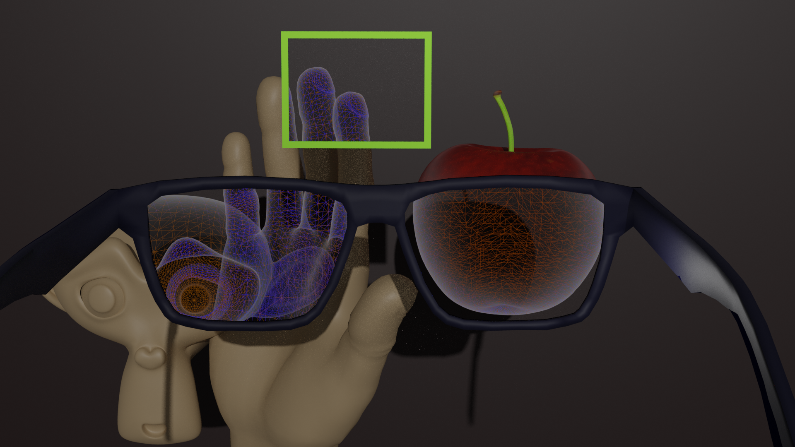
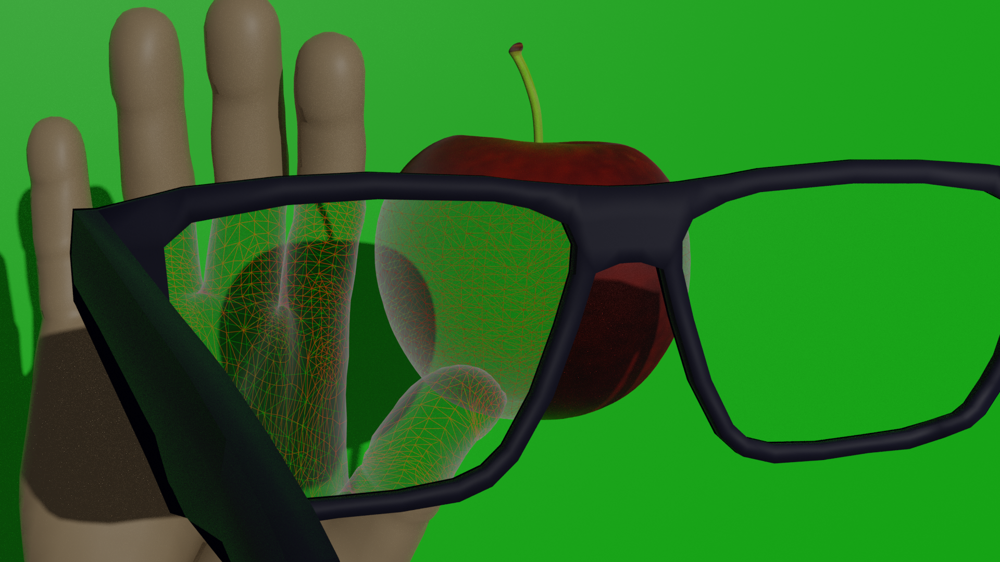
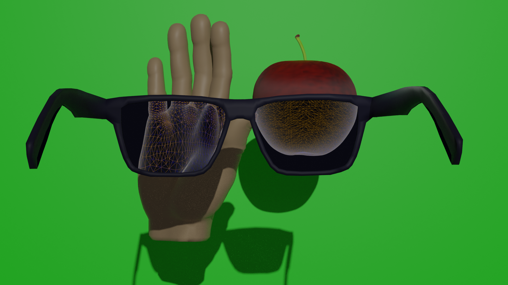
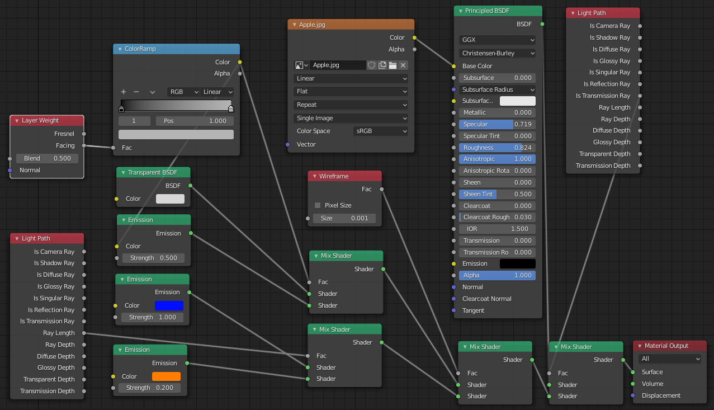

# Visualization-RGBxray
Project for the advanced course <i>DD2258 Introduction to Visualization, Computer Graphics and Image Video Processing</i> at KTH. The project is built in Blender and Python, aimed to visualize different x-ray effects. To begin with, the x-ray-glasses allow you to interpret vectors close to you in one color, and the ones further away in another, and at the same time see through objects. A great way to get a sense of the depth and volume of the objects in front of you.
 

 
The great scientist behind these glasses does however have a mischievous assistant. This assistant has included a python script in this Blender project. Running the script reveals a button called "Sneaky Stuff" in the side menu. If you click the "Make life harder for scientist"-button all the lines displayed in the x-ray will change to red and green, making life very hard for the scientist, since he's color blind. Continuing to click the button will only result in a switch between the R, G, and B components of the RGB-vector.
 
Under the same menu "Sneaky Stuff" there is also an option to change the color of the background. This button will make the background either red or green.
 

 
But worry not! The script has also produced a button in the same side menu called "Fixes", where you can make things right. By clicking "Bring in new glasses" animation keyframes are added. If you run the animation, a new set of glasses are introduced. The view through these glasses replaces both the background and x-ray lines in appropriate colors for someone who is colorblind.
 

 
### Node setup

 
 

